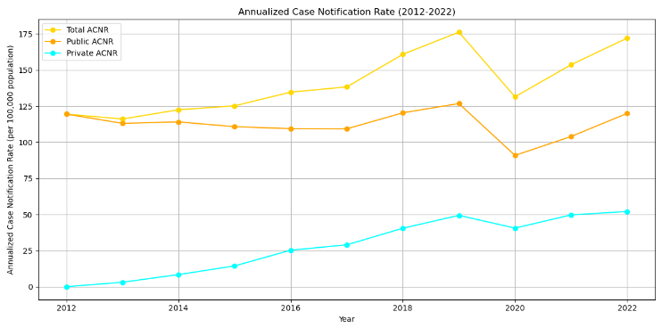

# National TB Report Summary - Chapter 3B
> **Brief Description:** - Chapter 3B of the "India TB Report 2023" focuses on the efforts and strategies related to TB case finding under the National Tuberculosis Elimination Programme (NTEP). It highlights the importance of early and accurate diagnosis for effective treatment and control of TB.
> 

---

## Table of Contents

- [Summary](#summary)
- [Program Codes ](#program-codes)
- [Plots](#plots)
- [Contribution](#contributipn)
- [Contact Details](#contact-details)

---

##Summary
**Chapter 3B of the "India TB Report 2023" focuses on the efforts and strategies related to TB case finding under the National Tuberculosis Elimination Programme (NTEP). It highlights the importance of early and accurate diagnosis for effective treatment and control of TB.**

### Key Highlights:

#### Passive Case Finding:
Relies on individuals seeking healthcare services when they exhibit TB symptoms.
Intensified case finding within health facilities ensures systematic screening for TB among all individuals seeking care.

#### Active Case Finding:
Systematic screening of high-risk populations outside health facilities, such as in communities and congregate settings.
Contact tracing is a significant component, where contacts of confirmed TB cases are screened for TB.

#### Presumptive TB Examination Rate (PTBER):
PTBER is defined as the number of presumptive TB cases tested per 100,000 population. The PTBER for India increased significantly from 676 in 2020 to 1281 in 2022 .

#### Proportion of Presumptive TB Cases Offered Molecular Diagnostics:
The proportion of presumptive TB cases tested with rapid molecular diagnostics has increased, enhancing the accuracy and speed of TB diagnosis.

#### Annualized TB Case Notification Rate (ACNR):
ACNR represents the number of TB cases notified per 100,000 population annually. The ACNR increased from 153 in 2021 to 172 in 2022 .

#### State-wise Performance:
Most states and Union Territories (UTs) reported an increase in TB case notifications in 2022 compared to 2021. The private sector notification rate achieved its highest ever at 52 cases per lakh population .

#### Innovative Approaches:
Deployment of mobile diagnostic units equipped with digital X-ray machines for early detection of TB in remote areas.
Use of AI-enabled portable X-ray units for community screening and early diagnosis.

#### Four-Quadrant Graph Analysis:
The chapter includes an analysis using a four-quadrant graph to understand the relationship between PTBER and ACNR across different states. States were classified based on high/low PTBER and high/low ACNR, showing an overall improvement in case finding efforts from 2019 to 2022 .

## Program-codes

The programs are written on jupiter notebook, You may run the program on Google colab by clicking on the colab badge below. However, the output may not be generated on colab. For that you have to download the program and run it locally. Make sure that the packages are all installed.

## Plots

## Contribution

The reports and programs are written by Santanu Karmakar

## Contact-details

If you wish to contact me, please leave a message (Preferably WhatsApp) on this number: 6291 894 897.
Please also mention why you are contacting me. Include your name and necessary details.
Thank you for taking an interest.
